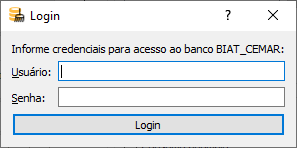

Abrangência
-----------

Serão analisados os circuitos MT e BT das subestações cujos códigos estiverem
listados em *SEs selecionadas*. Para movê-los da lista *SEs disponíveis* para
*SEs selecionadas* através do botão *>>*. De forma complementar, o botão *<<*
remove os códigos selecionados. 

.. image:: img/seccao_abrangencia_preenchida.png

Quando o programa consegue encontrar o arquivo de configuração do banco
automaticamente, e o primeiro serviço do arquivo corresponde à base onde estão
os dados importados, os códigos das SEs disponíveis serão carregados
automaticamente. Caso contrário, após o usuário indicar o arquivo e o serviço
corretos, é preciso pressionar o botão *Confirma* na seção *Banco de dados*.

.. image:: img/seccao_banco.png

Caso os dados para login ao banco de dados ainda não tenham sido informados, o
será solicitada as credenciais para conexão (usuário e senha). Nas execuções
seguintes, essas informações não precisam mais serem inseridas pelo usuário.

