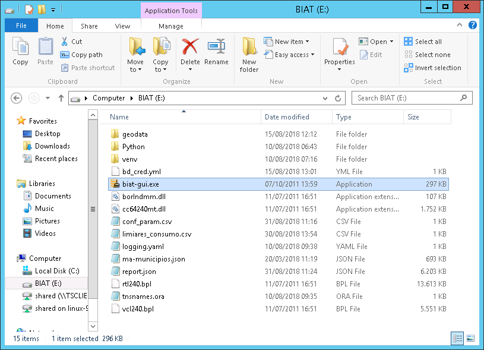
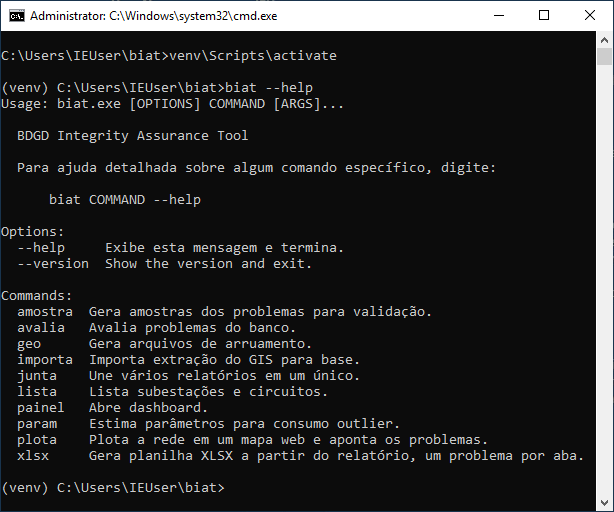

--------
 Acesso
--------

O procedimento de instalação descrito anteriormente já foi realizado no servidor
da CEMAR disponível no endereço 10.6.6.90. O programa está disponível na raiz da
unidade *E*, conforme ilustrado abaixo. O software possui uma interface em linha de
comando (CLI) e também uma interface gráfica (GUI). Para abrir a interface
gráfica, executar o arquivo *biat-gui.exe*:

A CLI é acessada através do terminal. Se o programa foi instalado em um ambiente
virtual `conforme descrito`_, é preciso ativá-lo para poder acessar o programa::

    # Ativação do ambiente virtual
    venv\Scripts\activate

    # Visualização dos comandos disponíveis
    biat --help

.. _conforme descrito: instalacao.html

