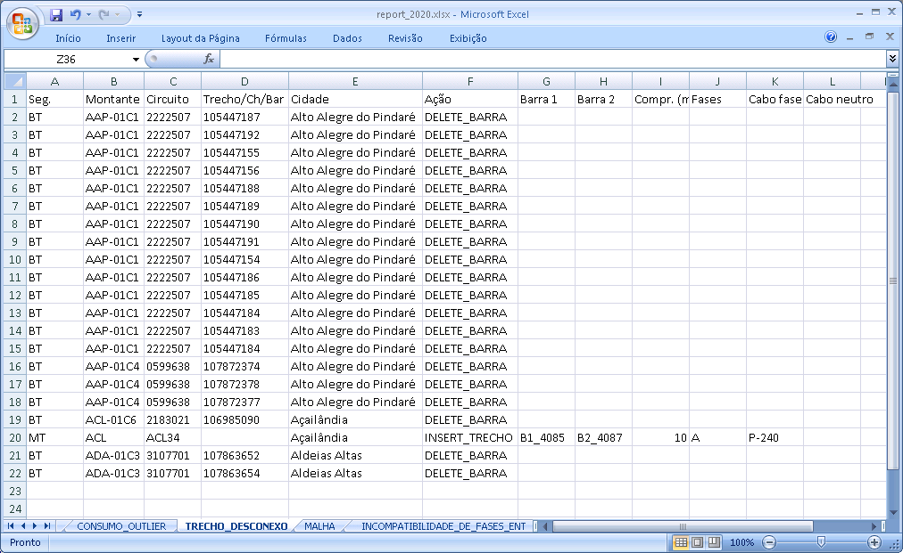

Ações
-----

Parametriza
~~~~~~~~~~~

Conforme abordado na seção `Limiares para parametrização do consumo anômalo`_,
ao pressionar o botão *Parametriza*, são calculados os limiares inferior e
superior dos valores de consumo anômalo. As variáveis "Fator de singularidade" e
"Média das derivadas" são ajustes que permitem calibrar estes limiares.

.. _Limiares para parametrização do consumo anômalo: parametrizacao.html

Avalia
~~~~~~

Antes de realizar a avaliação, convém se certificar da presença do arquivo
*municipios.json* na pasta *geodata*. Este arquivo é usado para indicar, no
relatório, em que município ocorreu o problema de cadastro encontrado no banco.
Isto permite uma análise quantitativa de problemas por município, apresentada no
dashboard_ através de um mapa do estado. Neste mapa, o usuário é capaz de criar
filtros para visualização dos problemas em regiões por ele definidas. A presença
desse arquivo e o uso desses filtros não é essencial para a avaliação, mas é um
recurso que pode ser útil nas análises.

Este arquivo possui formato *GeoJSON*, que é um formato de arquivo GIS
semelhante ao *Shapefile*. Para os estados brasileiros, com dados provenientes
do IBGE, ele pode ser obtido no site EarthWorks_ da Stanford University:

.. _EarthWorks: https://earthworks.stanford.edu/

.. image:: img/earthworks2.png

O processo de avaliação, ou seja, execução dos módulos selecionados, é iniciado
através do botão *Avalia*. Este botão fica habilitado quando existe alguma SE
selecionada e algum módulo_ marcado. 

.. _módulo: irregularidades.html

Durante a execução da avaliação, é exibida uma barra de progresso indicando a
porcentagem dos circuitos já processada, o tempo restante estimado para
conclusão, além do circuito sob análise no instante atual. 

A estimativa de tempo restante é calculado com base no percentual de circuitos
já processados e o tempo gasto até o momento. Como existem muitas diferenças em
termos de complexidade e erros apresentados dentre os diversos circuitos, a
precisão dessa estimativa é baixa no início e vai crescendo ao longo do
processo.

O resultado da análise é armazenado em um arquivo no formato JSON, por padrão
denominado *report.json*. Se um arquivo de mesmo nome já existir, ele será
sobrescrito. O nome do arquivo e o local de salvamento podem ser modificados no
botão *Altera*.

Dashboard
~~~~~~~~~

Após a execução, a visualização dos resultados contidos no arquivo gerado pode
ser feita através do botão *Resultados*. Ao pressioná-lo, o usuário pode
escolher abrir o relatório externamente (em um browser), ou no próprio programa.
O conteúdo exibido é o mesmo, mas o desempenho do browser para interagir com os
gráficos e tabelas é superior, sendo assim a forma indicada de visualização.

Ainda assim, dependendo do tamanho do arquivo JSON processado e da memória
disponível no computador, o tempo de carregamento do relatório pode ser de
vários segundos, tendo em vista a complexidade das funcionalidades que ele
apresenta.

O relatório contém diversos gráficos resumindo os problemas identificados no
banco de dados, seguido por tabelas, separadas por tipo de problema, que trazem
as informações individualizadas:

Os gráficos são interativos, permitindo a aplicação de filtros clicando sobre
seus elementos (barras, áreas, setores etc) que influenciam tanto na exibição do
gráfico manipulado quanto nos demais, além das informações apresentadas nas
tabelas.

Existem tabelas para cada tipo de problema analisado. Através dos comandos
localizados acima de cada uma delas, é possivel exportar seus dados diretamente
para XLSX, CSV ou PDF.

.. image:: img/dashboard_tabela.png

Planilha
~~~~~~~~

O resultado da análise também pode ser exportado do formato JSON para planilha
XLSX sem precisar abrir o dashboard_. Ao pressionar o botão *Planilha*, um
arquivo XLSX com o mesmo nome do arquivo JSON (apenas com extensão diferente) é
gerado na mesma pasta:

Os problemas estão divididos por abas:

