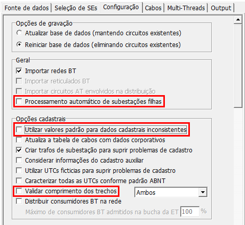

Banco de dados
--------------

O BIAT avalia os dados presentes em um banco de dados ORACLE. Estes dados provém
do banco *todos.mdb*. O botão *Abre importador* disponibiliza uma ferramenta
para importar dessa fonte para aquela:

Ao pressionar esse botão, a tela abaixo se abre. Na aba *Fonte de dados*,
deve-se selecionar a opção *DB MS-Access*, e selecionar o arquivo *todos.mdb* a
ser importado através do botão *Selecione a pasta*:

O destino desses dados deve ser configurado na aba *Output*. Após habilitar a
opção *Publicar rede em base corporativa*, deve-se preencher os parâmetros de
conexão com o banco. O botão *Teste* permite checar se o programa consegue se
conectar com o banco informado:

O importador, por padrão, realiza diversos procedimentos para correção
automática de dados inconsistentes, permitindo que o usuário consiga carregar a
rede elétrica no Interplan ou Pertec com pouco esforço. No entanto, isto acaba
mascarando os problemas existentes na base, inviabilizando o correto diagnóstico
deles pelo BIAT. Portanto, para evitar esse conflito, devem ser desmarcadas as
seguintes opções na aba Configuração do importador:

- *Utilizar valores padrão para dados cadastrais inconsistentes*
- *Validar comprimento dos trechos*

- *Calcula demanda*
- *Validar e corrigir fases BT das UTCs e dos Consumidores BT e IP*
- *Redefinir fases dos consumidores BT*

- *Utilizar as coordenadas mais próximas para os cons BT e IP*
- *Tratar elementos MT isolados*
- *Tratar elementos BT isolados*
- *Excluir barras MT isoladas e sem equipamentos*
- *Simplificação topológica de trechos MT*
- *Simplificação topológica de trechos BT*
- *Eliminar redes particulares*

Na aba *Cabos*, selecionar as opções *Sem tratamento de cabos* para cabos MT,
cabos BT e ramais de ligação.

O último passo é pressionar o botão *Importar*, que fica na parte inferior desta
tela. Terminado o processo, pode-se fechar a tela do importador e retornar à
tela inicial.

Uma vez importados os dados para o ORACLE, o BIAT poderá analisá-los. Para
conexão com este banco, é necessário apontar o arquivo de configurações,
denominado *tnsnames.ora*, que contém os parâmetros para identificá-lo
corretamente. O programa tenta, durante sua inicialização, encontrá-lo
automaticamente. A busca é feita nas pastas listadas na variável de ambiente
*PATH* do sistema operacional. Caso tal arquivo não seja localizado, este campo
estará em branco e o caminho deverá ser apontado pelo usuário através do botão
*Altera*.

Este arquivo pode conter a configuração para acesso a mais de um banco. O banco
desejado deve ser informado no campo *Serviço*, que irá apresentar os serviços
encontrados no arquivo *tnsnames.ora*. Por padrão, o primeiro serviço listado no
arquivo é selecionado. 

Caso o arquivo de configurações do banco tenha sido carregado automaticamente, e
as credenciais para acesso à base apontada pelo primeiro serviço já tiverem sido
informadas no passado, as subestações existentes em tal base serão carregadas
automaticamente e listadas em *SEs disponíveis*. 

Se o usuário precisou alterar o arquivo ou o serviço, ou se as credenciais ainda
não tiverem sido informadas, será preciso pressionar o botão *Confirma* para que
as subestações sejam carregadas. Se for o primeiro acesso a essa base, serão
solicitados usuário e senha:

.. image:: img/credenciais.png
