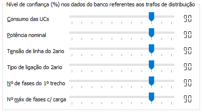

Nível de confiança em dados
---------------------------

Um dos módulos do BIAT faz, para cada circuito BT, a avaliação da consistência,
ou seja, busca de contradições, entre as seguintes informações:

  - Consumo das UCs da BT 
  - Potência nominal do trafo de distribuição 
  - Tensão de linha do secundário do trafo de distribuição 
  - Tipo da ligação no secundário do trafo de distribuição (mono, bi ou trifásica) 
  - Número de fases no primeiro trecho a jusante do trafo de distribuição 
  - Número de fases máximo das UCs a jusante do trafo de distribuição

Na presença de alguma contradição entre as informações, o software realiza
cálculos com base no nível de confiança que o usuário tem em cada um desses
dados para julgar qual deles deve estar correto, qual deve estar incorreto. Esse
nível de confiança é informado através dos campos ilustrados abaixo:

