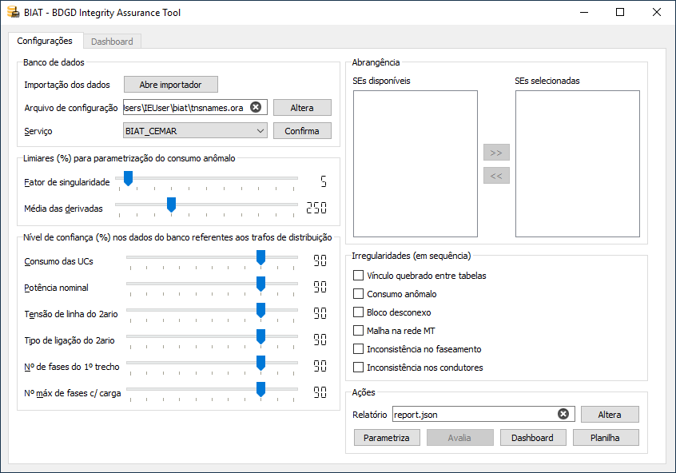

-------------------
 Interface gráfica
-------------------

A interface gráfica permite o usuário realizar as principais configurações e a
acessar as principais funcionalidades do software BIAT. Ela é composta de 6
seções, descritas a seguir:

.. toctree::
   :maxdepth: 2

   banco
   parametrizacao
   confianca
   abrangencia
   irregularidades
   acoes
