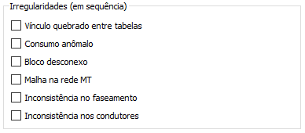
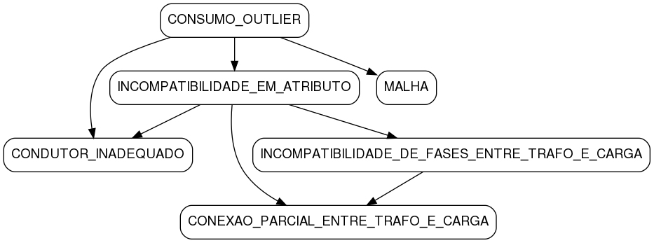

Irregularidades
---------------

O funcionalidade principal do software é a detecção de erros no banco de dados.
Como existem diversos tipos de informações nas diversas tabelas que compõem a
base, diversos módulos foram elaborados, cada um focando em um aspecto distinto.
A seleção dos módulos é feita através das caixas de seleção:

Para cada circuito lido do banco, o algoritmo de cada módulo selecionado será
executado na sequência em que eles estão apresentados na lista. Cada módulo
costuma tratar de apenas um problema, com exceção do "Inconsistência no
faseamento", que engloba 3 problemas:

  - Vínculo quebrado entre tabelas 
    
    * VINCULO_QUEBRADO                               

  - Consumo anômalo

    * CONSUMO_OUTLIER                                

  - Bloco desconexo

    * TRECHO_DESCONEXO                               

  - Malha na rede MT 

    * MALHA                                          

  - Inconsistência no faseamento

    * INCOMPATIBILIDADE_EM_ATRIBUTO                  
    * INCOMPATIBILIDADE_DE_FASES_ENTRE_TRAFO_E_CARGA 
    * CONEXAO_PARCIAL_ENTRE_TRAFO_E_CARGA            

  - Inconsistência nos condutores

    * CONDUTOR_INADEQUADO                            

O relatório da análise gerado pelo BIAT, inclusive, faz referência apenas ao
nome dos problemas, e não aos módulos. 

A sequência em que os problemas são tratados pelo usuário é importante e afeta o
processo de detecção. Isto porque a presença de um problema do tipo X pode
influenciar no diagnóstico e sugestão de resolução de um problema do tipo Y. O
grafo a seguir indica que problema (início da seta) pode influenciar no
diagnóstico e solução de que problema (final da seta):

.. dot -Tpng -Gfontsize=10 -o img/dependencias.png dependencias.dot

Por exemplo, um problema de "consumo anômalo" excessivamente alto de uma unidade
consumidora pode acarretar, caso não seja corrigido pelo usuário, em um falso
problema de "inconsistência no faseamento" por incompatibilidade em atributo,
onde o BIAT poderia acabar sugerindo, indevidamente, o aumento da potência
nominal do transformador, ou mesmo que este equipamento deveria ser trifásico ao
invés de monofásico. 

Portanto, se um circuito for diagnosticado com inúmeros problemas, convém tratar
primeiro aqueles mais a montante no gráfico das dependências (como
CONSUMO_OUTLIER), que são os abordados pelos primeiros módulos, e então rodar a
análise novamente. Neste procedimento sugerido, o último problema que deveria
ser tratado seria o CONEXAO_PARCIAL_ENTRE_TRAFO_E_CARGA.
