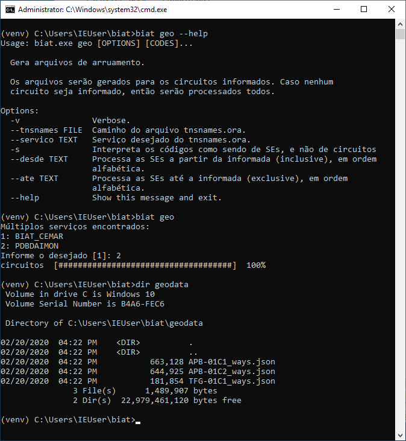

Irregularidades
---------------

O funcionalidade principal do software é a detecção de erros no banco de dados.
Como existem diversos tipos de informações nas diversas tabelas que compõem a
base, diversos módulos foram elaborados, cada um focando em um aspecto distinto.
A seleção dos módulos é feita através das caixas de seleção:

Para cada circuito lido do banco, o algoritmo de cada módulo selecionado será
executado na sequência em que eles estão apresentados na lista. Cada módulo
costuma tratar de apenas um problema, com exceção do "Inconsistência no
faseamento", que engloba 3 problemas:

  - Vínculo quebrado entre tabelas 
    
    * VINCULO_QUEBRADO                               

  - Consumo anômalo

    * CONSUMO_OUTLIER                                

  - Bloco desconexo

    * TRECHO_DESCONEXO                               

  - Malha na rede MT 

    * MALHA                                          

  - Inconsistência no faseamento

    * INCOMPATIBILIDADE_EM_ATRIBUTO                  
    * INCOMPATIBILIDADE_DE_FASES_ENTRE_TRAFO_E_CARGA 
    * CONEXAO_PARCIAL_ENTRE_TRAFO_E_CARGA            

  - Inconsistência nos condutores

    * CONDUTOR_INADEQUADO                            

O relatório da análise gerado pelo BIAT, inclusive, faz referência apenas ao
nome dos problemas, e não aos módulos. 

A sequência em que os problemas são tratados pelo usuário é importante e afeta o
processo de detecção. Isto porque a presença de um problema do tipo X pode
influenciar no diagnóstico e sugestão de resolução de um problema do tipo Y. O
grafo a seguir indica que problema (início da seta) pode influenciar no
diagnóstico e solução de que problema (final da seta):

.. dot -Tpng -Gfontsize=10 -o img/dependencias.png dependencias.dot

Por exemplo, um problema de "consumo anômalo" excessivamente alto de uma unidade
consumidora pode acarretar, caso não seja corrigido pelo usuário, em um falso
problema de "inconsistência no faseamento" por incompatibilidade em atributo,
onde o BIAT poderia acabar sugerindo, indevidamente, o aumento da potência
nominal do transformador, ou mesmo que este equipamento deveria ser trifásico ao
invés de monofásico. 

Portanto, se um circuito for diagnosticado com inúmeros problemas, convém tratar
primeiro aqueles mais a montante no gráfico das dependências (como
CONSUMO_OUTLIER), que são os abordados pelos primeiros módulos, e então rodar a
análise novamente. Neste procedimento sugerido, o último problema que deveria
ser tratado seria o CONEXAO_PARCIAL_ENTRE_TRAFO_E_CARGA.

O módulo bloco desconexo, em especial, requer alguns preparativos antes de sua
execução, conforme explicado a seguir.

Bloco desconexo
~~~~~~~~~~~~~~~

Um bloco pode estar desconexo por falta de trecho ou por existir uma chave
aberta no único caminho até a fonte. Se for necessário propor um novo trecho, o
BIAT estima qual é o par de barras que deveria estar conectado, sendo uma das
barras pertencente ao bloco desconexo (barra desconectada) e a outra ligada ao
restante da rede (barra conectada).

Nesta heurística, busca-se criar apenas um trecho que:

  - una barras com a mesma tensão, sendo uma delas pertencente ao bloco
    desconexo;
  - tenha o menor comprimento possível;

Vários trechos podem estar conectados a uma barra. Cada trecho possui um tipo de
cabo de fase, um de neutro, e uma configuração de faseamento. Um candidato a
novo trecho para unir duas barras deve estar condizente com esses trechos já
existentes. Logo, o trecho novo deve ser tal que atenda todos os critérios para
ser viável:

  - deve unir barras com a mesma tensão nominal;
  - deve conter todas as fases que incidem na barra desconectada;
  - todas essas fases devem estar contidas no conjunto de fases da barra
    conectada;
  - O cabo da fase (neutro) de algum trecho da barra conectada deve ser igual ao
    cabo da fase (neutro) de algum trecho da barra desconectada; 
  - O trecho novo não deve cruzar as fronteiras de uma quadra (caso ambas as
    barras estejam fora de quadras).

A avaliação das quadras formadas pela intersecção das ruas requer dados
georeferenciados do arruamento das áreas por onde passam os circuitos. O BIAT
possui uma interface com o site OpenStreetMap_ que permite a extração dessas
informações para a área de abrangência dos circuitos. Após tratamento, esses
dados são salvos em arquivos formato *GeoJSON*, um para cada circuito, na pasta
*geodata*. Para rodar esse processo, executar no terminal::

    # Ativar o ambiente virtual
    venv\Scripts\activate

    # Rodar o biat
    biat geo

.. _OpenStreetMap: https://www.openstreetmap.org/

