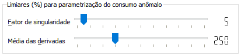

Limiares para parametrização do consumo anômalo
-----------------------------------------------

O módulo de detecção de consumo anômalo *(outlier)* implementa um algoritmo
desenvolvido especialmente para este projeto. Ele considera a quantidade de
dados disponíveis de consumo energético mensal para cada grupo analisado (em
função da classe de consumo, faseamento, e nível de tensão) para definir os
limiares do que é considerado típico e o que é atípico. 

O algoritmo é iterativo e é executado enquanto ambos os critérios forem
satisfeitos:

  - o fator de singularidade for menor do que o limiar informado; e 
  - a média da derivada for maior que o limiar informado.

O "fator de singularidade" indica o quão únicos são os valores de consumo. Um
fator igual a 1 significa que não há dois registros com um mesmo nível de
consumo. Um fator tendendo a zero significa que existem muitos registros para
cada valor de consumo. Uma massa de dados com um fator muito alto não permite
estimar a presença de outliers. É calculado como a razão entre a quantidade de
registros não repetidos pela quantidade de registros total. 

A "média das derivadas" na curva dos consumos ordenados e não repetidos é um
indício da presença de outliers. Se todos os valores de consumo (que é uma
variável inteira dada em kWh) da massa de dados (excluídos os valores repetidos)
estiverem ordenados e não possuírem intervalos maiores que 1 kWh, então a média
da derivada dessa curva será 1. Nesse caso extremo, não há descontinuidade nas
observações, logo nenhum indício da presença de outliers.

A diminuição do limiar inferior para o fator de singularidade e/ou a elevação do
limiar superior da média da derivada dá margem para a realização de mais
iterações, buscando limiares mais próximos dos valores de consumo,
consequentemente aumentando o número de observações classificadas como outlier. 

Estes limiares são informados nos campos abaixo. Uma vez definidos os parâmetros
desejados, deve-se clicar no botão *Parametriza*, na seção *Ações*, que irá
rodar o comando informado na caixa de texto, e irá salvar os resultados no
arquivo *conf_param.csv*. Esse arquivo é lido pelo módulo de avaliação do
consumo:

